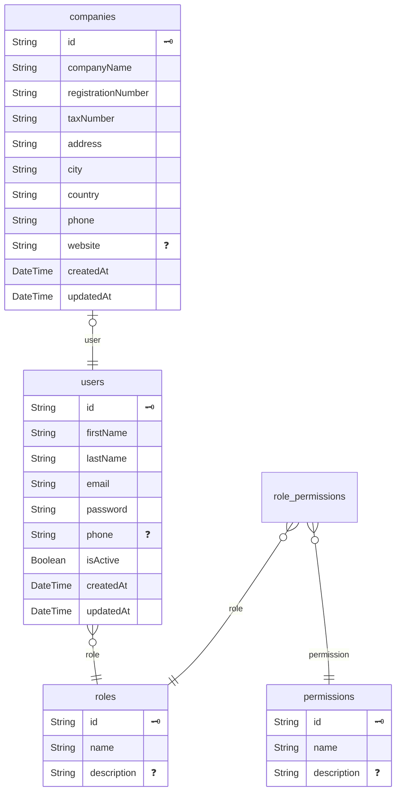

```mermaid
erDiagram

  "roles" {
    String id "🗝️"
    String name 
    String description "❓"
    }
  

  "permissions" {
    String id "🗝️"
    String name 
    String description "❓"
    }
  

  "role_permissions" {

    }
  

  "users" {
    String id "🗝️"
    String firstName 
    String lastName 
    String email 
    String password 
    String phone "❓"
    Boolean isActive 
    DateTime createdAt 
    DateTime updatedAt 
    }
  

  "companies" {
    String id "🗝️"
    String companyName 
    String registrationNumber 
    String taxNumber 
    String address 
    String city 
    String country 
    String phone 
    String website "❓"
    DateTime createdAt 
    DateTime updatedAt 
    }
  
    "role_permissions" }o--|| roles : "role"
    "role_permissions" }o--|| permissions : "permission"
    "users" }o--|| roles : "role"
    "companies" |o--|| users : "user"
```
